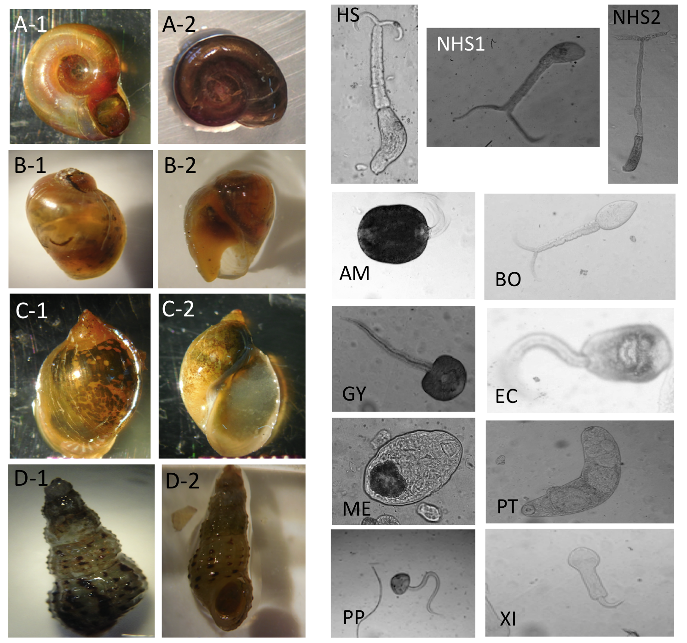

# Schisto-parasite-classification
CNNs, transfer learning, VGG16 pre-trained model, Keras, TensorFlow backened

## Introduction
Schistosomiasis is a neglected tropical disease (NTD) infecting over 250 million people worldwide. The current approach to mitigate this disease is to deliver the drugs to treat needed communities. However, parasites are primarily transmitted through environment reservoirs where freshwater snails serve as intermediate hosts. People use the contaminated water source for their daily tasks and get re-infected after the drug treatment. Therefore, drug administration alone is not effective for Schistosomiasis control. Recent studies [1, 2] show that snail population control is essential to spot disease transmission risks. To discerning between human parasitic worms and other non-human parasitic species in snails is a necessary step to precise quantification of human risk. As part of Stanford's [Program for Disease Ecology, Health and the Environment](https://ecohealthsolutions.stanford.edu/), our team has collected 5,543 images of freshwater snails as well as 5,140 images of parasitic cercariae, from 11 morphospecies liberated from the Biomphalaria and Bulinus spp. snails encountered and dissected, in Senegal Africa during 2015-2018. This dataset will be made public for the research community (download here: under construction).

Our research team have used these images as training dataset to develop a deep learning model that classifies images of 11 parasite categories with higher accuracy (88%) than well-trained human parasitologists. Details of this research can be found in the publication [3]. Our model facilitats transfer learning using VGG16 and convolutional neural networks (CNNs).

In addition, by working with IBM's Cognitive Open Technologies & Performance Group, we have built a Javascript web application that incorporates with our classification model, which allows users to select their own parasite images and the classification model will provide prediction suggestions for your parasite images. The web application is located [here](https://schisto-classify.mybluemix.net).



Image examples for snail and parasite classes. For snail classes, A-1 and A-2: Biomphalaria. B-1 and B-2: Bulinus. C-1 and C-2: Lymnaea. D-1 and D-2: Melanoides; abbreviations of parasite classes as follow, HS: Human-schisto, NHS1: Nonhuman- schisto forktail type I, NHS2: Nonhuman- schisto forktail type II, AM: Amphistome, BO: Bovis, EC: Echino, GY: Gymno, ME: Metacerc, PP: Parapleurolophocercous, PT: Parthenitae, XI-Xiphidiocercariae.

## Data
The `dataset` folder in this repository is empty. You can download the dataset here (under construction). The file structure is shown below:

```
    ├── dataset                   <- root
        ├── training_set          <- training set folders
        |   ├── Amphistome        <- image files for parasite species
        |   ├── Bovis           
        |   ├── Echino
        |   └── ...
        |
        ├── test_set              <- validation set folders
        |   ├── Amphistome        <- image files for parasite species
        |   ├── Bovis           
        |   ├── Echino
        |   └── ...
```  

## Code
The script is in Python, building CNNs and transfer learning (with VGG16), using Keras package with Tensorflow backened. Augmenting in training data is also built in the code. Main script for training is `main_train.py` where you can adjust model parameters, such as batch size and training epoch. CNN model building and data preprocessing are in `model_train.py`, where you can adjust hyperparameters, such as drop out rate. Main script for making predictions for validation set is `main_validation.py`; loading weights and model building are handled in `model_validation.py`. `plot_confusion_matrix.py` is the utility script for plotting confusion matrix of the results.

The main scripts will create VGG16 model ([keras](https://keras.io/applications/#vgg16)) that is without the final fully-connected layers, by specifying `include_top=False`. The model uses ImageNet weights.

## Run
For training, run:
```
python main_train.py
```
The script will:
- (1) Preprocess train/ validation data, save as `.npy` files
- (2) Perform the training
- (3) Save the weights (HDF5 file, such as`model.h5`)
- (4) Make predictions on validation set
- (5) Report accuracy on validation set
- (6) Produce training history, and confusion matrix plots

For validation, run:
```
python main_validation.py
```
The script will:
- (1) Load preprocessed data (`.npy` files)
- (2) Load the weights (HDF5 file, such as`model.h5`)
- (3) Make predictions on validation set
- (4) Report accuracy on validation set
- (5) Produce training history, and confusion matrix plots

## Results
The best model (parasite: `bottleneck_fc_model_93.h5`, snail: `bottleneck_fc_model_snail.h5`) classifies 11 species of parasite with 88% accuracy and 4 species of snail with 99% accuracy. The confusion matrix plots (for the parasite model) are: `cm.png` and `cm_norm.py` (noralimzation). Training history plots (for the parasite model) are: `history_accuracy.png` and `history_loss.png`.

## Re-train for new data
You can use the code to build a new model for your own data, but you may need to make further modifications on the code.

## Requirements
- [Anaconda / Python 2.7](https://www.continuum.io/downloads)
- [TensorFlow 1.12](https://www.tensorflow.org/)
- [Keras 2.2](https://keras.io/)
- [sklearn 0.16](https://scikit-learn.org/stable/)

## Relevant links
Links:
- [The Program for Disease Ecology, Health and the Environment](http://www.theupstreamalliance.org/)
- [Prawn vs. Snail: Nature’s Role in Fighting Disease](https://woods.stanford.edu/news-events/news/prawn-vs-snail-natures-role-fighting-disease)

## References
- [1] Sokolow SH, Wood CL, Jones IJ, Swartz SJ, Lopez M, Hsieh MH, Lafferty KD, Kuris AM, Rickards C, De Leo GA. Global assessment of schistosomiasis control over the past century shows targeting the snail intermediate host works best. PLoS neglected tropical diseases. 2016 Jul 21;10(7):e0004794.
- [2] Sokolow SH, Huttinger E, Jouanard N, Hsieh MH, Lafferty KD, Kuris AM, Riveau G, Senghor S, Thiam C, N’Diaye A, Faye DS. Reduced transmission of human schistosomiasis after restoration of a native river prawn that preys on the snail intermediate host. Proceedings of the National Academy of Sciences. 2015 Aug 4;112(31):9650-5.
- [3] Liu ZY-C, Chamberlin AJ, Shome P, Jones IJ, Riveau G, Jouanard N, Ndione, Sokolow SH, De Leo GA. Identification of snails and parasites of medical importance via convolutional neural network: an application for human schistosomiasis. PLoS neglected tropical diseases. 2019 (In Review).

## Contact
- Data and model: achamb@stanford.edu; zacycliu@stanford.edu or ssokolow@stanford.edu
- Web App: pvaneck@us.ibm.com

## Last updated
Aug 28, 2019
